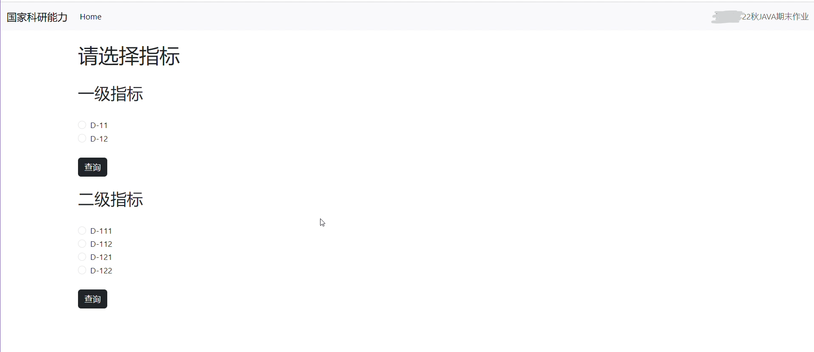
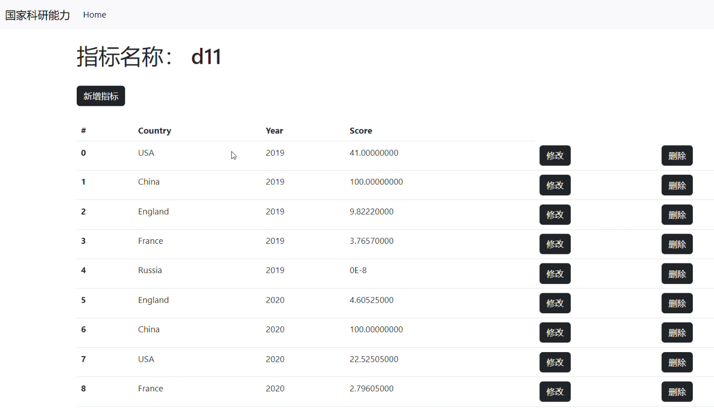
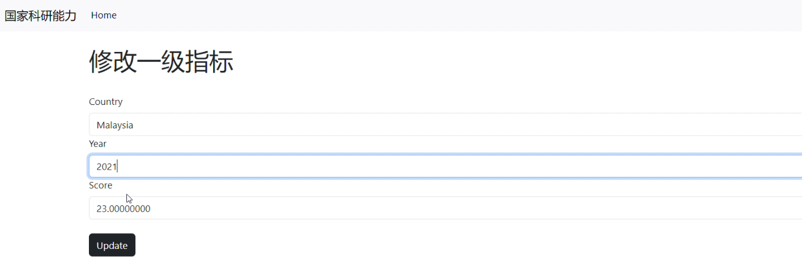
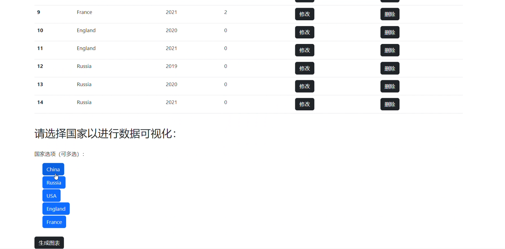
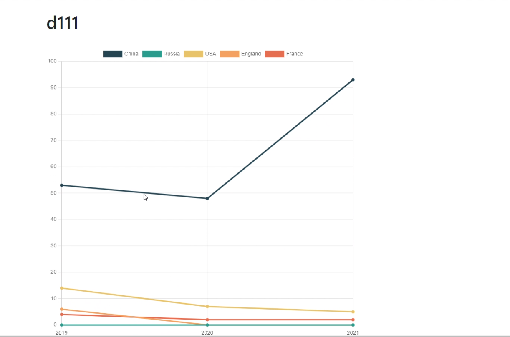

# Java Web App

This is my Java Web Application project for my 2022 Object-oriented Programming with Java class at Peking University.

For a brief summary report of the DBMS, you may refer to "Java大作业说明文档.pdf" (reported in Chinese language)

## A basic introduction for the folders and files:

* javaproject: folder for data handling
* WebApp: folder for JavaBeans, Servlets, jsp etc.

## Examples:

Updated: 18th July 2023
